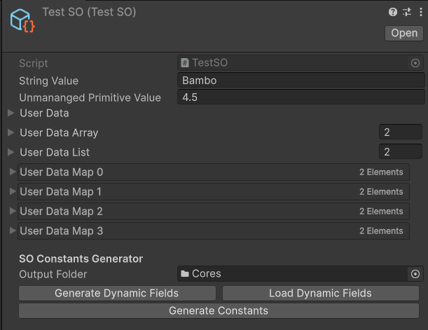

# SO Constants Generator


[](https://opensource.org/licenses/MIT)

## Overview

**SOConstantsGenerator** is a Constants Code Generator for ScriptableObjects. Aim to make storing and accessing immutable data in Burst context easier.

## Installation

To install, paste the following URL into Unity's **Package Manager**:

1. Open **Package Manager**.
2. Click the **+** button.
3. Select **"Add package from git URL..."**.
4. Enter:

```bash
https://github.com/hoangtongvu/SOConstantsGenerator.git?path=/Assets/SOConstantsGenerator#1.1.0
```

## Usage

### Step 1: Annotate your ScriptableObject

Firstly, annotate your `ScriptableObject` with `[GenerateConstantsFor]` attribute.

```cs
[GenerateConstantsFor("GameBalance", "Core")] // output class name + namespace
public partial class TestSO : ScriptableObject { ... }
```

Source Generator will generate Editor code to show `OutputFolder` field and various buttons for Code Generation later. 



Next, choose fields you want to convert to constants and annotate them with `[ConstantField]` attribute.

```cs
public sealed class ConstantFieldAttribute : Attribute
{
    public Type[] ConverterTypes { get; }

    public ConstantFieldAttribute(params Type[] converterTypes) { ... }
}
```

```cs
public partial class TestSO : ScriptableObject
{
    // string → FixedString64Bytes (using FixedString64BytesConverter)
    [ConstantField(typeof(FixedString64BytesConverter))]
    public string StringValue;

    // Unmanaged primitive → const field
    [ConstantField]
    public float UnmanagedPrimitiveValue = 4.5f;

    // Managed type → Unmanaged type (using Converter)
    [ConstantField(typeof(UserData.UnmanagedConverter))]
    public UserData.Managed UserData;

    // Arrays and Lists are supported  
    [ConstantField(typeof(UserData.UnmanagedConverter))]
    public UserData.Managed[] UserDataArray;

    // IDictionary → emitted as a struct with static TryGetValue(), GetValue(), ...
    [ConstantField(typeof(UserKey.UnmanagedConverter), typeof(UserData.UnmanagedConverter))]
    public SerializedDictionary<UserKey.Managed, UserData.Managed> UserDataMap;
}
```

### Step 2: Generate

Select your `ScriptableObject.asset` file in the Editor. Choose the `OutputFolder` for the generated file then click Generate to emit the constants file.

```cs
// This file is auto-generated, do not change.
namespace Core;

public static class GameBalance
{
    // Converted from TestSO.StringValue (string)
    public static readonly FixedString64Bytes StringValue =
        @"Bambo";

    // Converted from TestSO.UnmanangedPrimitiveValue (float)
    public const System.Single UnmanangedPrimitiveValue = 4.5f;

    // Converted from TestSO.UserData (UserData.Managed)
    public static readonly UserData.Unmanaged UserData =
        Unsafe.As<byte, UserData.Unmanaged>(ref new byte[] { ... }[0]);

    // Converted from TestSO.UserDataArray (UserData.Managed[])
    public static readonly UserData.Unmanaged[] UserDataArray = new UserData.Unmanaged[]
    {
        Unsafe.As<byte, UserData.Unmanaged>(ref new byte[] { ... }[0]),
        Unsafe.As<byte, UserData.Unmanaged>(ref new byte[] { ... }[0]),
        // ...
    };

    // Converted from TestSO.UserDataMap (SerializedDictionary<UserKey.Managed, UserData.Managed>)
    public struct UserDataMap
    {
        public const int Count = ...;
        public static readonly UserKey.Unmanaged[] Keys = ...;
        public static readonly UserData.Unmanaged[] Values = ...;
        public static readonly t_Enumerable Enumerable;
        public static bool TryGetValue(UserKey.Unmanaged key, out UserData.Unmanaged value);
        // Many other methods ...
    }
}
```

### Step 3: Consume

```cs
// Fully static, no allocation, Burst-safe
float speed = GameBalance.UnmanagedPrimitiveValue;
FixedString64Bytes name = GameBalance.StringValue;

if (GameBalance.UserDataMap.TryGetValue(key, out var data))
{
    // use data
}
```

## Supported Field Types

| Source Type                                                                                                                                                | Generated Output                                         |
| ---------------------------------------------------------------------------------------------------------------------------------------------------------- | -------------------------------------------------------- |
| Unmanaged primitive `T` (`float`, `int`, …)                                                                                                                | `public const T`                                         |
| Custom unmanaged struct `T`                                                                                                                                | `public static readonly T`                               |
| Custom managed class `T` (with `ITypeConverter<T, U>`)                                                                                                     | `public static readonly U`                               |
| `T[]` / `List<T>` (`T` is an unmanaged struct)                                                                                                             | `public static readonly T[]`                             |
| `T[]` / `List<T>` (`T` is a class) (with `ITypeConverter<T, U>`) (`U` is an unmanaged struct)                                                              | `public static readonly U[]`                             |
| Any Dictionary classes that inherit from `System.Collections.IDictionary` (support Key/Value of type unmanaged structs or classes with converters) | A struct that provides many methods as a normal Dictionary |

## Custom Type Converters

Write your own converters to convert any managed types to unmanaged versions:

```cs
public class FixedString64BytesConverter : ITypeConverter<string, FixedString64Bytes>
{
    public FixedString64Bytes Convert(string source)
        => new(source);
}
```

Then pass your converter types to `[ConstantField(typeof(UnmanagedConverter))]`.